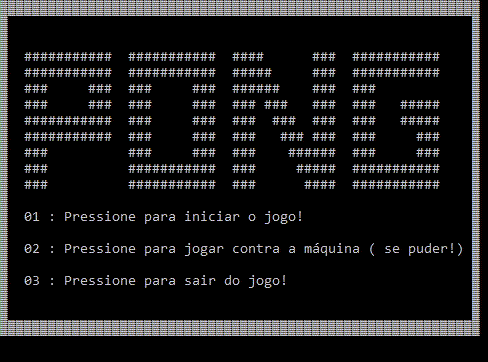

<h1 align="center">
   Jogo Pong em C
</h1>

  

  
  
  

  

  

  <a href="#sobre-o-projeto">Sobre o Projeto</a>&nbsp;&nbsp;&nbsp;|&nbsp;&nbsp;&nbsp;
  <a href="#instruções-de-jogo">Instruções de Jogo</a>&nbsp;&nbsp;&nbsp;|&nbsp;&nbsp;&nbsp;
  <a href="#licença">Licença</a>

 

  

# Sobre o projeto

O Jogo Pong feito em C é um projeto que foi utilizado como Trabalho Final na disciplina de Programação Computacional para a Universidade Federal do Ceará - Campus Sobral no ano de 2016.

Alunos:
- Francisco Willian Santos Praciano
- André Veras

# Instruções de jogo
## Modos
- Jogador vs. Jogador;
- Jogador vs. Máquina.

## Instruções do modo Jogador vs. Jogador
O jogador pontua quando o outro jogador não consegue rebater a bola. Vence quem conseguir fazer 2 pontos primeiro.

1. Jogador 1: Use as teclas 'w' para a barra subir e 's' para a barra descer;
2. Jogador 2: Use as teclas '↑' para a barra subir e '↓' para a barra descer;

## Instruções do modo Jogador vs. Máquina
O jogador pontua quando consegue rebater a bola. A máquina pontua quando o jogador deixa a bola passar. O jogador vence quando ele fizer 4 pontos; O jogador perde se ele deixar a bola passar 2 vezes.

1. Jogador 1: Use as teclas 'w' para a barra subir e 's' para a barra descer;

# Licença

Esse projeto está sob a licença MIT. Veja o arquivo [LICENSE](LICENSE.md) para mais detalhes.

